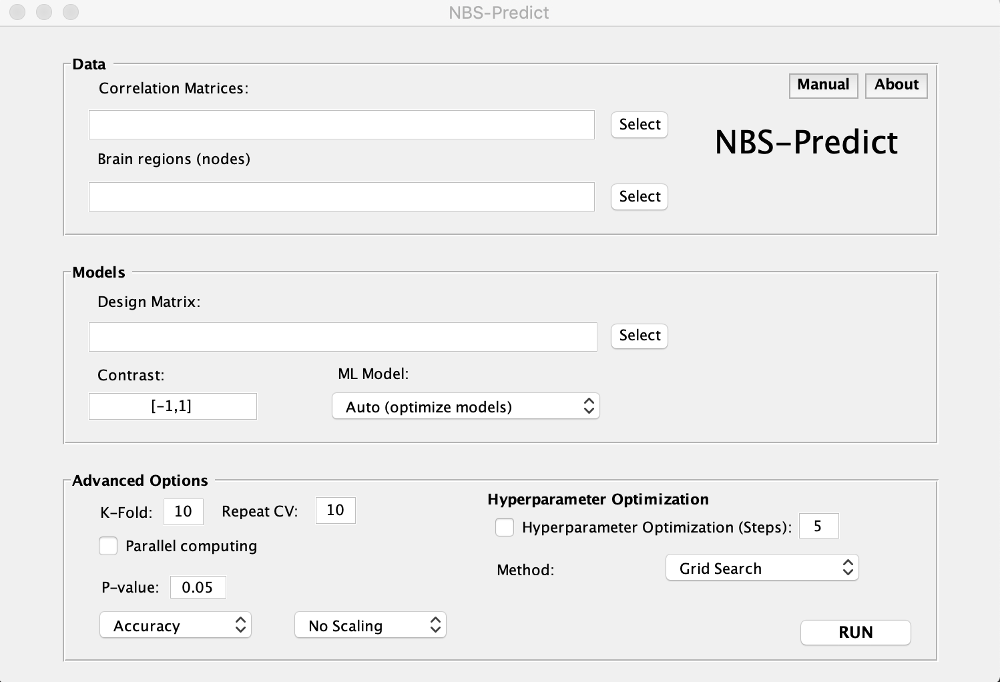
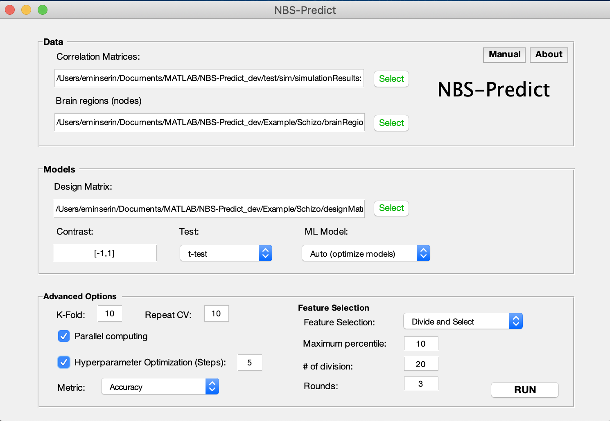
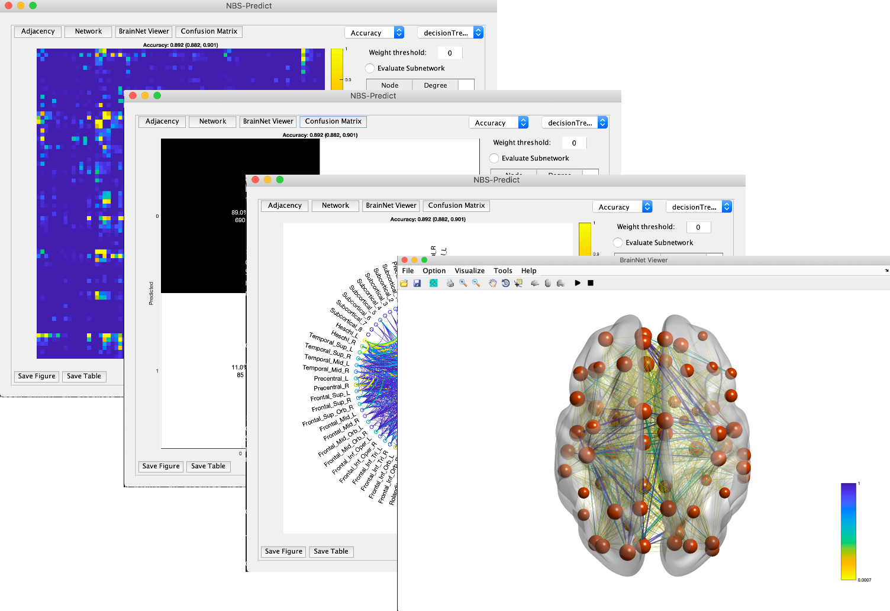

# NBS-Predict
NBS-Predict is a prediction-based extension of the Network-based Statistic (Zalesky et. al., 2010). NBS-Predict aims to close the gap between group-level analysis and subject-specific prediction based on individually important network variations by combining a repeated nested cross-validation structure with machine learning models and graph theoretical networks.

## Overview
NBS-Predict performs in a repeated nested cross-validation structure where model evaluation is conducted in the outer loop and feature selection (or suprathreshold edge optimization) including hyperparameter optimization is performed in the inner loop. 

## Prerequisites

NBS-Predict requires the following software and toolboxes to run properly: 

```
Matlab (2014a or newer) 
Statistics Toolbox (before R2015a) or Statistics and Machine Learning Toolbox
Parallel Computing Toolbox (optional)
```

## Installing

1. Download or clone this repository to a direction of your choice. 

```
git clone --recursive git@github.com:eminSerin/NBS-Predict.git
```

2. Run Matlab and navigate NBS-Predict directory using either commad window or current folder section. Then, type this command to add NBS-Predict to your Matlab path. 

```
addpath(genpath(pwd));
```

## Example

1. Type this command to start NBS-Predict
```
start_NBSPredict();
```
2. A graphical user interface of NBS-Predict will automatically appear on the screen.

 

3. Select a directory including correlation matrices. Then, select brain regions and design matrix files and set a contrast matrix for the general linear model performed during feature selection in the inner loop. Optionally, you may define advanced parameters such as number of CV folds, number of nested-CV repetitions, performance metrics, feature selection algorithms and their specific parameters. Once you finish selecting data and optional parameters, hit the RUN button to start analysis. NBS-Predict will last from minutes to hours depending on computer, sample size and brain parcellation atlas used for a project. 

 

4. Once NBS-Predict finishes analysis, a graphical user interface to display results will automatically appear on the screen.
Here, you see figures for weighted adjacency matrix, weighted subnetwork, weight distribution and visualization of weighted subnetwork on a 3D brain model. Weights represent the frequency of edges being found in a winner graph component across surrogate models. You may set a weight threshold to see a subnetwork consisting edges whose weight is greater than the threshold. In this way, you can get an idea of which connections between brain regions (i.e., edges) may have contrast of a interest. Also, by clicking the "Save Figure" button, you can save figures in several formats. 

 

See the [MANUAL.pdf](MANUAL.pdf) file for detailed user guide. 

## Test

You may test the prediction performance of NBS-Predict on several synthetic network (small-world, scale-free or random) data by typing this command. 

```
test_NBSPredict(parameters);
```

## Versioning

We use [SemVer](http://semver.org/) for versioning. For the versions available, see the [tags on this repository](https://github.com/eminSerin/NBS-Predict). 

## Compatibility

NBS-Predict was developed on Matlab R2017b and tested on Matlab R2017b and R2018b. 

## Authors

NBS-Predict was designed by Emin Serin and Johann D. Kruschwitz, and developed by Emin Serin. 

## Contributing

You may contribute in this project in many ways such as bringing new features to NBS-Predict, improving documentantation or reporting bugs. See the [CONTRIBUTING.md](CONTRIBUTING.md) file for details

## License

This project is licensed under the GNU General Public License v3.0 - see the [LICENSE](LICENSE) file for details

## References

References for the functions or toolboxes used in NBS-Predict toolbox: 

1. Chang, C. C., & Lin, C. J. (2011). LIBSVM: A library for support vector machines. ACM transactions on intelligent systems and technology (TIST), 2(3), 27.
2. Roland Pfister (2019). dlmcell (https://www.mathworks.com/matlabcentral/fileexchange/25387-dlmcell), MATLAB Central File Exchange. Retrieved September 3, 2019.
3. Xia, M., Wang, J., & He, Y. (2013). BrainNet Viewer: a network visualization tool for human brain connectomics. PloS one, 8(7), e68910.
4. Zalesky, A., Fornito, A., & Bullmore, E. T. (2010). Network-based statistic: identifying differences in brain networks. Neuroimage, 53(4), 1197-1207.

