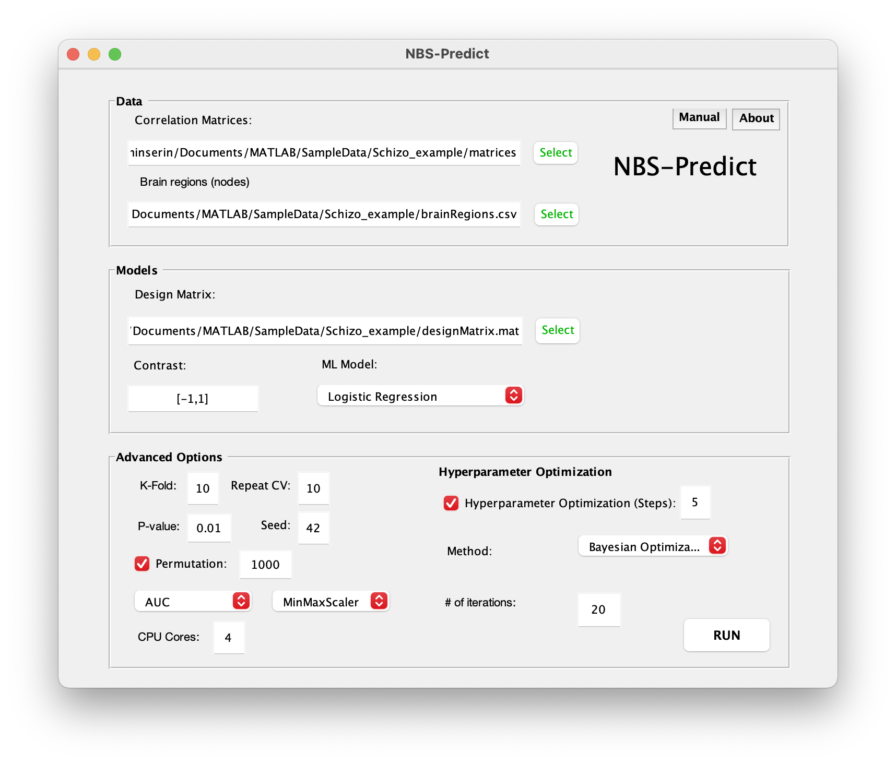

# NBS-Predict

<p align="center">
   
</p>

NBS-Predict is a prediction-based extension of the Network-based Statistic (Zalesky et. al., 2010). NBS-Predict aims to provide a fast way to identify neuroimaging-based biomarkers with high generalizability by combining machine learning with graph theory in a cross-validation structure.

## Overview
NBS-Predict operates in a cross-validation structure (nested if hyperparameter optimization is desired). The general algorithm consists of model evaluation, feature selection like suprathreshold edge selection, hyperparameter optimization (optionally), and machine learning algorithm optimization (optionally).  

## Prerequisites

NBS-Predict requires the following software and toolboxes to run properly: 

```
Matlab (2014a or newer) 
Statistics Toolbox (before R2015a) or Statistics and Machine Learning Toolbox
Parallel Computing Toolbox (optional)
```

## Installing

1. Download or clone this repository to a direction of your choice. 

```
git clone --recursive git@github.com:eminSerin/NBS-Predict.git
```

2. Run MATLAB and navigate the NBS-Predict's directory using either the command window or the Current Folder window. Then, type this command to add NBS-Predict to your MATLAB path. 

```
addpath(genpath(pwd));
```

## Example

1. Type this command to start NBS-Predict
```
start_NBSPredict();
```
2. A graphical user interface of NBS-Predict will automatically appear on the screen.

 

3. Select the directory that contains subjects' connectivity matrices. Then, select brain parcellation and design matrix files. Specify a contrast vector for the statistical model used selecting suprathreshold edges across folds. Optionally, you may define advanced parameters such as number of CV folds, number of CV repetitions, performance metrics. Once you finish selecting data and optional parameters, hit the RUN button to start the analysis. NBS-Predict will last from minutes to hours depending on the computer, sample size, and brain parcellation atlas used. 

 

4. Following the analysis, the NBS-Predict Results Viewer window will automatically appear on the screen. Here, you view display weighted adjacency matrix, weighted network on a circular graph, weighted network on a 3D brain surface (BrainNet Viewer, Xia et al., 2013), and confusion matrix. Weights represent the presence of edges in the selected connected component across outer folds and their prediction performances. That allows us to evaluate the contribution of each edge to the overall model straightforwardly. You can further set a weight threshold to visualize a subnetwork comprising the most relevant edges. Also, by clicking the "Save Figure" button, you can save figures in several formats. 

 

See the [MANUAL.pdf](docs/MANUAL.pdf) file for the detailed user guide. 

Additionally, see the [Tutorial_HCP.pdf](docs/Tutorial_HCP.pdf) file for example use of NBS-Predict. 

## Test

You may test the performance of NBS-Predict in predicting target variable or identifying edges with ground truth on several synthetic networks (small-world, scale-free or random) data by typing this command: 

```
test_NBSPredict(parameters);
```

The parameters are extensively documented in the test_NBSPredict.m function.

You may also use the simulation function that automatically runs the test function n times and using various parameters. To do that, type this command: 

```
sim_testNBSPredict(parameters);
```

The parameters are extensively documented in the sim_testNBSPredict.m function. 

Also, see the [Tutorial_Simulation.pdf](docs/Tutorial_Simulation.pdf) document for an example use of the simulation function.

## Versioning

We use [SemVer](http://semver.org/) for versioning. For the versions available, see the [tags on this repository](https://github.com/eminSerin/NBS-Predict). 

## Compatibility

NBS-Predict was developed on Matlab R2017b and tested on Matlab R2017b and R2018b. 

## Authors

NBS-Predict was designed by Emin Serin, Andrew Zalesky, Johann D. Kruschwitz and Henrik Walter, and developed by Emin Serin. 

## Contributing

You may contribute in this project in many ways such as bringing new features to NBS-Predict, improving documentantation or reporting bugs. See the [CONTRIBUTING.md](CONTRIBUTING.md) file for details

## License

This project is licensed under the GNU General Public License v3.0 - see the [LICENSE.md](LICENSE.md) file for details

## References

References for the functions or toolboxes used in NBS-Predict toolbox: 

1. Glmnet for Matlab (2013) Qian, J., Hastie, T., Friedman, J., Tibshirani, R. and Simon, N. http://www.stanford.edu/~hastie/glmnet_matlab/
2. Morel, (2018). Gramm: grammar of graphics plotting in Matlab. Journal of Open Source Software, 3(23), 568, https://doi.org/10.21105/joss.00568
3. Paul Kassebaum (2020). circularGraph (https://github.com/paul-kassebaum-mathworks/circularGraph), GitHub. Retrieved September 6, 2020.
4. Roland Pfister (2019). dlmcell (https://www.mathworks.com/matlabcentral/fileexchange/25387-dlmcell), MATLAB Central File Exchange. Retrieved September 3, 2019.
5. Xia, M., Wang, J., & He, Y. (2013). BrainNet Viewer: a network visualization tool for human brain connectomics. PloS one, 8(7), e68910.
6. Zalesky, A., Fornito, A., & Bullmore, E. T. (2010). Network-based statistic: identifying differences in brain networks. Neuroimage, 53(4), 1197-1207.

